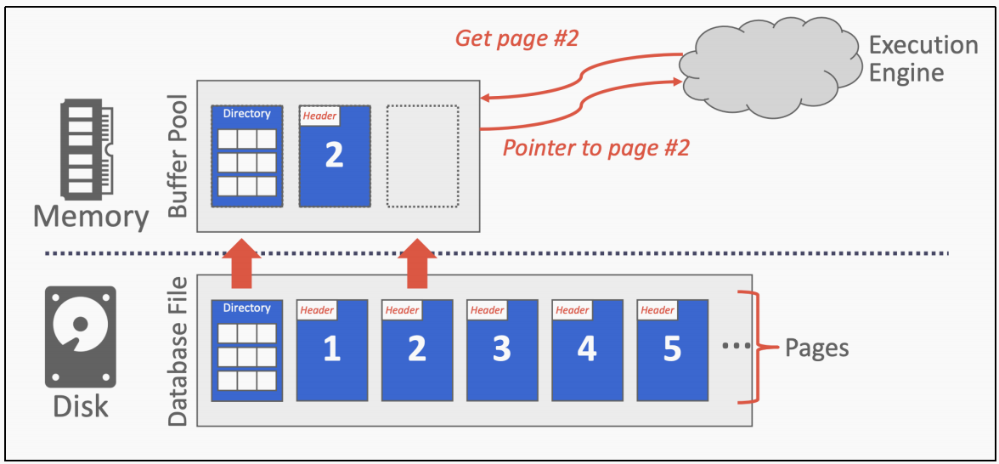
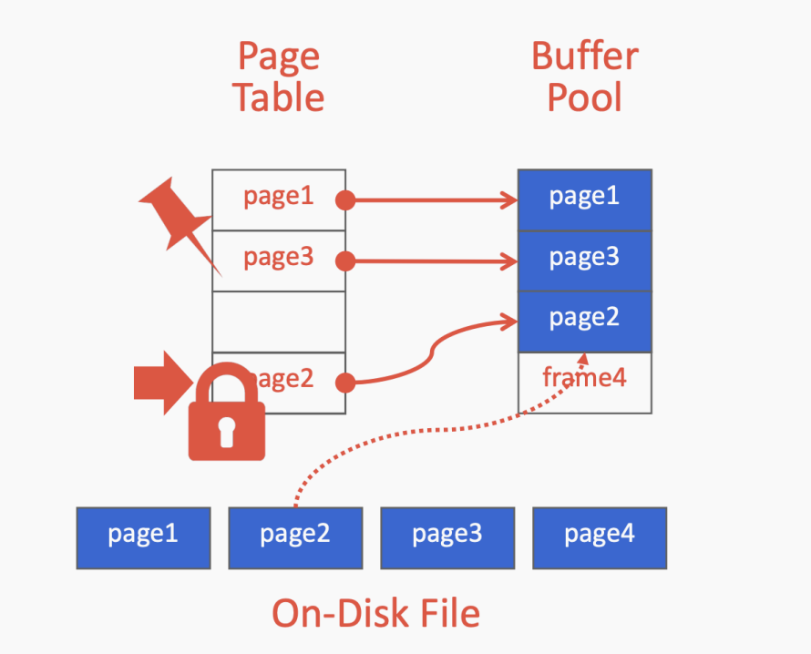
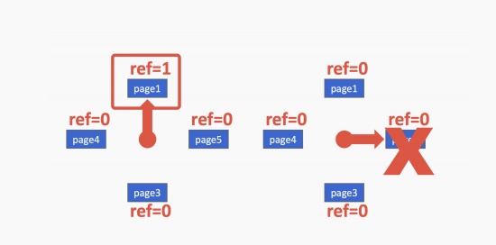

# Buffer Pools

## 1 介绍

DBMS负责管理其内存和从磁盘来回移动数据。因此，对于大部分情况，数据不能直接在磁盘上操作，任何数据库都必须能够有效地将以文件表示的数据从其磁盘移动到内存，以便它可以使用。图1显示了这种交互的关系图。在理想的情况下从执行引擎的角度来看，它应该“看起来”好像所有数据都在内存中。它不需要担心如何将数据提取到内存中。

考虑这个问题的另一种方式是空间和时间控制。

*空间控制*指的是页面在磁盘上的物理写入位置。空间控制的目标是使要一起使用的页面，通常在磁盘上物理上尽可能靠近。
*时间控制*指的是何时将页面读入内存，何时将其写入磁盘。时间控制目标将必须从磁盘读取数据的停机次数降至最低。

## 2 锁和闩锁

在讨论DBMS如何保护其内部数据时，我们需要区分锁和闩锁元素。
**Locks** :锁是一种高级的逻辑原语，用于从其他事物那里保护数据库(如元组、表、数据库)的内容。事务将在其整个持续时间内持有锁。数据库系统可以对在运行查询时持有锁的用户暴露。锁需要能够回滚更改。
**Latches** :闩锁是一种低级保护原语，DBMS将其用于其内部数据中的关键部分结构(例如，哈希表，内存区域)。锁存仅在操作进行期间保持。闩锁不需要能够回滚更改。

## 3 缓冲池 （Buffer Pool）

*缓冲池*是从磁盘读取的页面的内存缓存。它本质上是数据库内部分配的一个大内存区域存储从磁盘获取的页面。
缓冲池的内存区域组织为固定大小的页数组。每个数组条目称为一个*帧*。当DBMS请求一个页面时，它从磁盘复制到缓冲池的一个帧中。当一个页面请求时，数据库系统可以先搜索缓冲池。只有当没有找到该页时，系统才进行读取从磁盘中拷贝该页。脏页被缓冲，不会立即写回。参见图2中的缓冲池的内存组织示意图。

### 缓冲池元数据

缓冲池必须维护某些元数据，以便有效和正确地使用。
首先，*page table*是一个内存中的哈希表，它跟踪当前在内存中的页面。它将page id映射到到缓冲池中的帧位置。因为缓冲池中页面的顺序不一定反映磁盘上的顺序，这个额外的间接层允许在池中识别页面位置。
**注意**:不要将*page table*与*page directory*混淆，后者是从page id到页在数据库文件中位置的映射。所有对*page directory*的更改都必须记录在磁盘上，以便DBMS能够找到。
*page table*还为每个页维护额外的元数据，一个脏标志和一个引脚/引用计数器。当线程修改页面时，它会设置dirty标志。这向存储管理器指示该页必须被写回磁盘。
pin/reference计数器跟踪当前正在访问该页的线程数量(无论是读取还是修改)。线程必须在访问该页之前增加计数器。如果页面的pin数大于0，则不允许存储管理器从内存中取出该页。pin不妨碍其他事务并发地访问页面

### 内存分配策略

数据库中的内存根据两个策略分配给缓冲池。

全局策略处理DBMS应该做出的决策，以使正在执行的整个工作负载受益。它考虑所有活动事务，以找到分配内存的最佳决策。

另一种选择是本地策略，它做出的决策可以使单个查询或事务运行得更快，尽管它可能不适合整个工作量。本地策略将帧分配给特定的事务，而不考虑并发事务的行为。

大多数系统同时使用全局策略和局部策略。

## 4 缓冲池优化

有许多方法可以优化缓冲池，使其适合应用程序的工作负载

### Multiple Buffer Pools 

DBMS可以为不同的目的维护多个缓冲池(即每个数据库缓冲池，每个页面类型)缓冲池)。然后，每个缓冲池可以采用针对存储在其中的数据量身定制的本地策略。这种方法可以有助于减少闩锁争用并改善局部性。

将所需页面映射到缓冲池的两种方法是对象id和散列。

*对象id*涉及扩展记录id以具有对象标识符。然后通过对象标识符，进行映射从对象到特定的缓冲池都可以维护。

另一种方法是散列，其中DBMS对*page id*进行散列以选择要访问的缓冲池。

### Pre-fetching

DBMS还可以通过基于查询计划预取页面来进行优化。那么，当第一组页面被加载的时候，第二组页面可以被预提取到缓冲池中。这种方法通常在DBMS使用顺序访问多个页面时使用。缓冲池管理器也可以预取树中的叶子页在树索引数据结构中。

### Scan Sharing （ Synchronized Scans ）

查询游标可以重用从存储或运算符计算中检索到的数据。这允许附加多个查询到扫描表的单个游标。如果一个查询开始扫描，或者已经有一个查询开始扫描，那么DBMS就会将第二个查询的游标附加到现有游标上。DBMS跟踪第二个查询的连接第一个游标的位置，以便它可以在到达数据结构的末端时完成扫描。

### Buffer Pool ByPass

顺序扫描操作符不会将获取的页面存储在缓冲池中，以避免开销。相反，查询运行在内存中。如果操作符需要读取大量在磁盘上连续的页面序列，则此方法非常有效。*Buffer Pool ByPass*也可以用于临时数据(排序、连接)。

## 5  Replacement Policies

当DBMS需要释放一个帧来为新页腾出空间时，它必须决定从缓冲池中删除哪个页。

替换策略是DBMS实现的一种算法，它决定当缓冲池需要空间时，删除哪些也页面。

替换策略的实现目标是提高正确性、准确性、速度和元数据开销。

### Least Recently Used （ LRU ）

最近最少使用替换策略维护每个页面最后访问时间的时间戳。DBMS选择时间戳最早的页面逐出。这个时间戳可以存储在一个单独的数据结构中，比如一个队列，允许排序，并通过减少逐出时的排序时间来提高效率。

### CLOCK

时钟策略是LRU的近似值，不需要每个页面都有单独的时间戳。在CLOCK策略中，每一页都有一个参考位。当访问某个页面时，设置为1。

为了可视化这一点，用“时钟指针”将页面组织在一个圆形缓冲区中。在扫描时检查页面的位是否正确设置为1。如果是，则设置为零，如果不是，则将其驱逐。这样，时钟指针就能记住两次驱逐之间的位置。

### Alternatives

LRU和CLOCK替换策略存在许多问题。

也就是说，LRU和CLOCK容易受到*连续泛洪*的影响，在这种情况下，缓冲池的内容会被顺序的扫描破坏。由于顺序扫描读取许多页的速度很快，因此缓冲池会被填满，所以其他查询所读取的页由于具有较早的时间戳将被驱逐。在这个场景中，最近的时间戳没有准确反映我们真正想要驱逐的页面。

有三种解决方案可以解决LRU和CLOCK策略的缺点。

一种解决方案是LRU-K，它将最后K个引用的历史记录作为时间戳跟踪并计算后续访问之间的时间间隔。该历史记录用于预测下一次访问页面的时间。

另一个优化是每个查询的本地化。DBMS在每个事务/查询中选择驱逐哪些页面。这最大限度地减少了每个查询对缓冲池的污染

最后，优先级提示允许事务根据上下文在查询执行期间告诉缓冲池页面是否重要。

### Dirty Pages

有两种方法可以处理带有脏位的页面。最快的选择是删除缓冲池中的任何非脏页面。一种较慢的方法是将脏页写回磁盘，以确保其更改被持久化。

这两种方法说明了快速驱逐与在未来不会再读的脏写页之间的权衡。

避免不必要地输出页面的一种方法是*background writing*。通过*background writing*写入时，DBMS可以定期遍历页表并将脏页写入磁盘。当一个脏页被安全地写入，DBMS可以驱逐页或只是取消脏标志。

## 6 其他的内存池

除了元组和索引之外，DBMS还需要内存。根据实现，这些其他内存池可能并不总是由磁盘支持。

​	• Sorting + Join Buffers

​	• Query Caches

​	• Maintenance Buffers

​	• Log Buffers

​	• Dictionary Caches

## 7 OS Page Cache

大多数磁盘操作都通过操作系统API。除非另有明确说明，否则操作系统维护自己的文件系统缓存。

大多数DBMS使用直接I/O来绕过操作系统的缓存，以避免页面的冗余副本和不得不进行管理不同的驱逐政策。

Postgres是一个使用操作系统页面缓存的数据库系统的例子。

## 8 Disk I/O Scheduling

DBMS维护内部队列来跟踪来自整个系统的页面读/写请求。任务优先级的确定基于以下几个因素:

​	• Sequencial vs. Random I/O

​	• Critical Path Task vs. Background Task

​	• Table vs. Index vs. Log vs. Ephemeral Data

​	• Transaction Information

​	• User-based SLAs